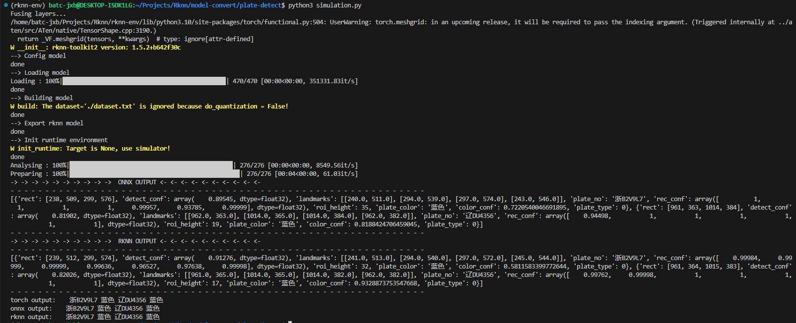
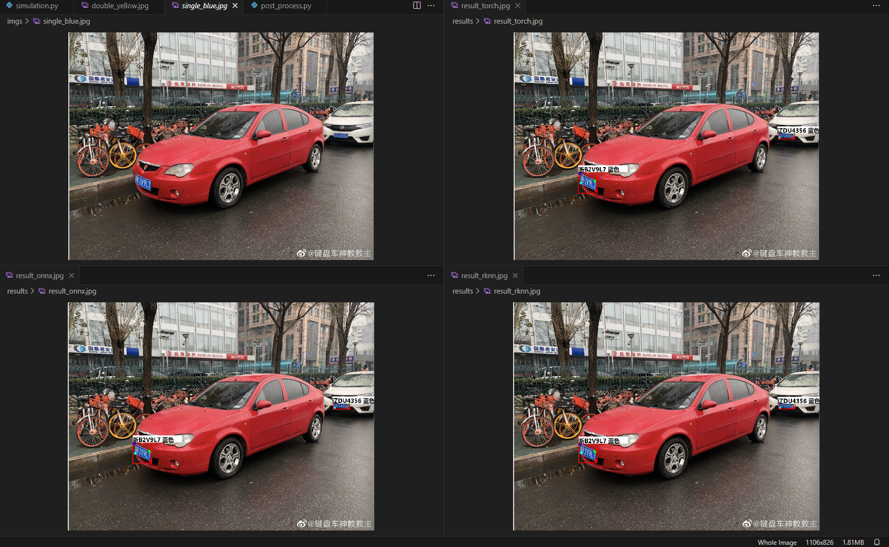

## 项目简介

该项目尝试利用[rknn-toolkit2](https://github.com/rockchip-linux/rknn-toolkit2)提供的工具链，在`x86-64`的电脑端将`.pt`格式的权重文件转换为`rknn`格式，以便于在`Rockchip`相关NPU上进行部署。该项目所使用的[车牌识别](https://github.com/we0091234/Chinese_license_plate_detection_recognition)代码使用`pytorch`进行编写。

## 项目目录介绍

- `models/`，`plate_recognition/`以及`utils/`文件夹，是项目辅助函数以及相关模型代码的存放目录。
    - `model/`文件夹为仿照`yolov5`目标检测，改写的车牌检测部分代码。
    - `plate_recognition/`文件夹为车牌识别部分代码，依赖于前述的车牌检测。
    - `utils/`文件夹下为辅助函数。其中`post_process.py`中提供了一些后处理所需要的函数。

- `fonts/`以及`imgs/`中为所需的资源目录。
    - `fonts/`提供了最终标注车牌所需要的字体文件。
    - `imgs/`提供了一些照片信息以供测试。

- `weights/`下存放有`plate_detect.pt`以及`plate_rec_color.pth`权重文件。
    - `plate_detect.pt`为车牌检测网络的权重文件，参考了yolov5。
    - `plate_rec_color.pth`为车牌识别网络的权重文件，主要针对前一阶段检测出的车牌区域进行识别，获取车牌信息。
    - 本项目便是尝试将`plate_detect.pt`转换为`rknn`格式进行部署。

- `checks/`中`check_preds.py`主要是获得`onnx`推理结果与`rknn`推理结果的余弦相似度。

- `figure/`中为`README.md`文件所需要的资源文件。

- 结果存放目录`preds/`以及`results/`未给出，可以在执行代码前在当前路径下新建。

## 运行说明

- 在正确安装rknn-toolkit2之后，便可以通过`python3 simulation.py`命令将`onnx`文件转成`rknn`文件。同时在PC端调用仿真器进行模拟推理，推理结果也会以`npy`文件格式保存于`preds/`目录下。

- 如果想将`plate_detect.pt`转换成`plate_detect.onnx`文件，可以通过执行`python3 export.py --weights ./weights/plate-detect.pt`命令完成转换。转换的结果保存于`weights/`下。

- 如果想获得推理结果的相对误差以及余弦相似度，可以执行`python3 checks/check_preds.py`

## 运行结果

- 运行环境
    - PC端：WSL on Windows 10 (Linux发行版为`Ubuntu 22.04`)
    - rknn所需要的python环境：参见[rknn-toolkit2](https://github.com/rockchip-linux/rknn-toolkit2)相关文件说明。

- 执行`rknn`转换代码，并进行仿真器推理。

- 识别结果展示 (原图，pytorch，onnx以及rknn)

